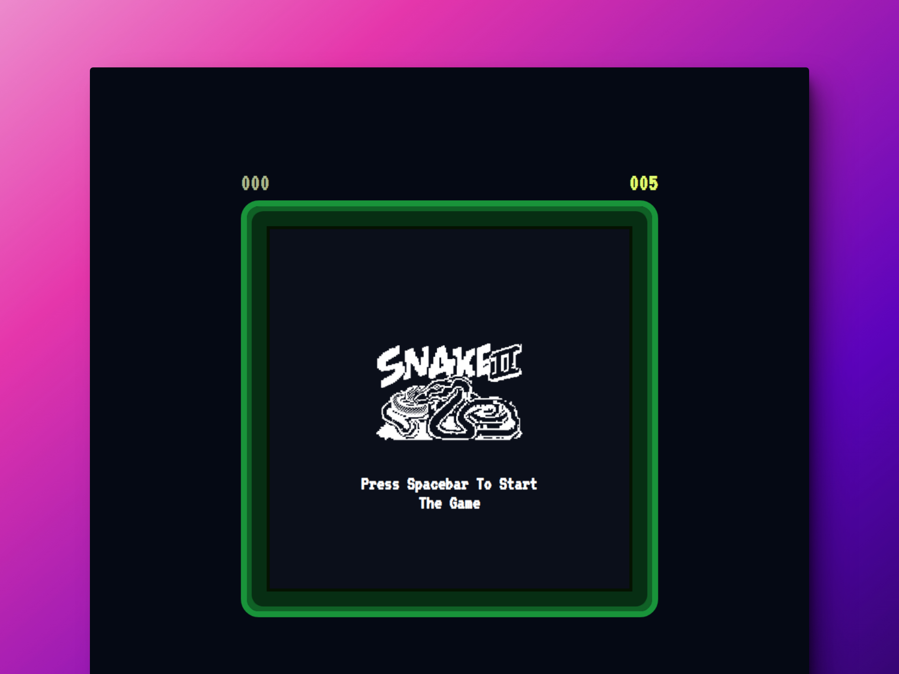
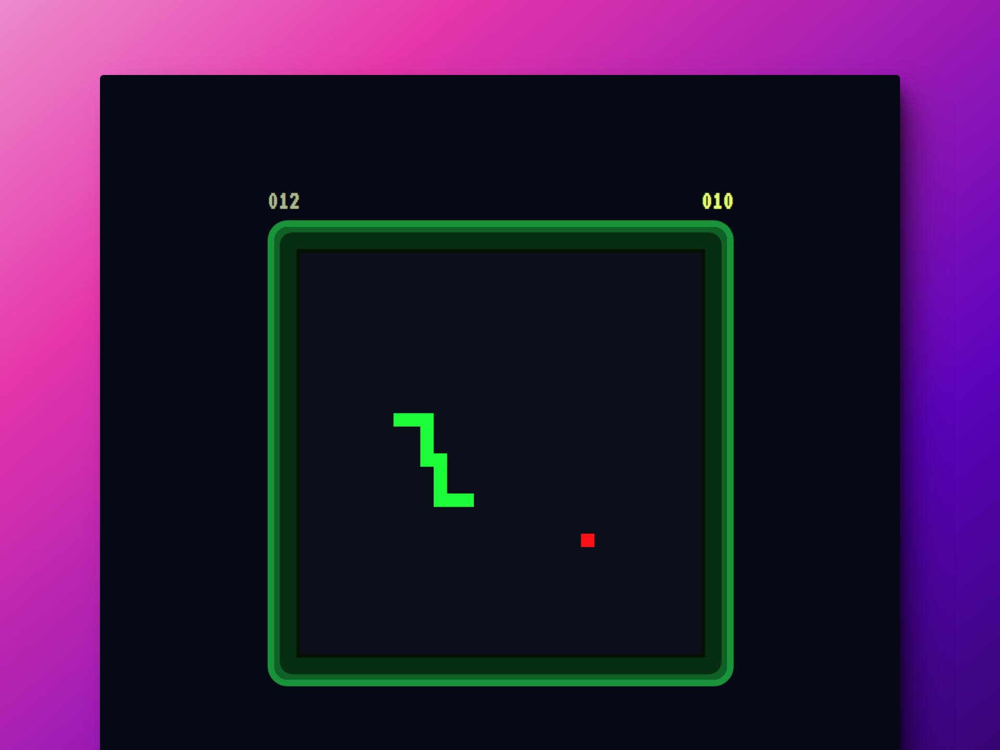

# 🐍 HTML/CSS/JS: Snake Game

### Juego retro Snake Game hecho de manera vanilla para la web.

> 🧩 Aquí puedes ver su [**Live Demo.**](https://snake-game-abrahamgalue.netlify.app/)

## 🚀 Descripción

**Snake Game** es un videojuego retro en el que debes controlar una serpiente que se mueve por la pantalla recogiendo puntos.

A medida que la serpiente come puntos, se vuelve más larga y aumenta la dificultad del juego.

## 🎭 Tecnologías

El proyecto utiliza las siguientes tecnologías:

- **HTML5/CSS3** para la estructura y el diseño del juego.

* **JavaScript** para la lógica del juego y la interacción del usuario.

- [**Font Squirrel**](https://www.fontsquirrel.com/tools/webfont-generator) para la tipografía retro.
